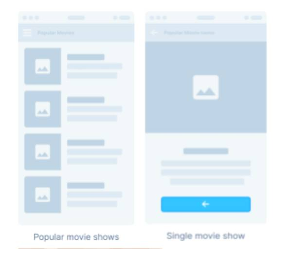

# qhala

This is the flutter version of the Qhala android technical interview challenge :stuck_out_tongue_winking_eye: That I saw somewhere.

## Android Technologies
- Navigation – To manage your application navigation.
- Dagger - Hilt - Used to provide dependency injection.
- Retrofit 2 - OkHttp3 - Request/response API.
- Room – To save data if in offline mode.
- Glide - For image loading.
- Coroutines - reactive programming paradigm.
- LiveData - To see UI updates with data changes.
- Data Binding - bind UI components in layouts to data sources.

But since this is Flutter here is my chosen Technologies:
- Navigation - New Flutter 2.0 Navigation
- Dio - Request/response API
- Moor - To save data if in offline mode.
- CachedNetworkImage - For image Loading
- Flutter_cubit - For state management (UI updates with data changes && bind UI components in layouts to data sources.)

## Test
1. UI Tests
2. Repositories Test
3. Cubit Tests

## Design wireframe

## Todo
1. ~Setup project file structure~
2. Implement the UI mock up
3. Add the HTTP layer
4. Offline storage with moor
5. Add Tests
6. Setup CI/CD

## Getting Started

This project is a starting point for a Flutter application.

A few resources to get you started if this is your first Flutter project:

- [Lab: Write your first Flutter app](https://flutter.dev/docs/get-started/codelab)
- [Cookbook: Useful Flutter samples](https://flutter.dev/docs/cookbook)

For help getting started with Flutter, view our
[online documentation](https://flutter.dev/docs), which offers tutorials,
samples, guidance on mobile development, and a full API reference.
